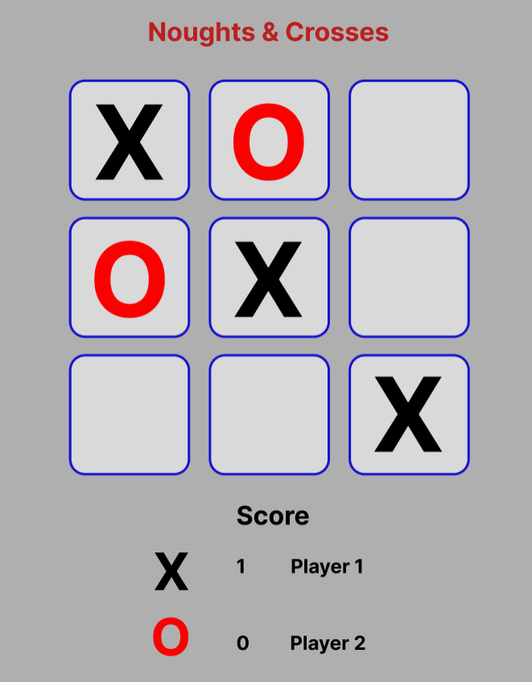

<h1 align="center">Noughts & Crosses</h1>

[View the live project here.](https://mitchduke.github.io/Noughts-and-Crosses-Milestone-2/)

This is a browser base game of noughts and crosses or tic tac toe to be played between two people for fun.

<h2 align="center"></h2>

## Table of Contents

1.  [User Experience](#user-experience-ux)
    -   [Design](#design)
    -   [Wireframes](#wireframes)

2.  [The Final Design](#the-final-design)
    -   [Main](#Main-page)

3.  [Features](#features)
    -   [Page Content](#page-content)

4.  [Technologies Used](#technologies-used)
    -   [Languages Used](#languages-used)
    -   [Frameworks, Libraries & Programs Used](#frameworks-libraries--programs-used)

5.  [Testing](#testing)
    -   [Validation](#validation)
    -   [Performance](#performance)
    -   [Further Testing](#further-testing)
    -   [Further Improvements](#further-improvements)
    -   [Testing User Stories from User Experience (UX) Section](#testing-user-stories-from-user-experience-ux-section)
        -   [First Time Visitor Goals](#first-time-visitor-goals-1)
        -   [Returning Visitor Goals](#returning-visitor-goals-1)
        -   [Frequent Visitor Goals](#frequent-user-goals-1)
    -   [Known Bugs](#known-bugs)

6.  [Deployment](#deployment)
    -   [Github Pages](#github-pages)
    -   [Forking The Github Repository](#forking-the-github-repository)
    -   [Making a Local Clone](#making-a-local-clone)

7.  [Credits](#credits)
    -   [Code](#code)
    -   [Content](#content)
    -   [Media](#media)
    -   [Acknowledgements](#acknowledgements)

## User Experience (UX)

-   ### User stories

    -   #### First Time Visitor Goals

        1. As a First Time Visitor, I want to easily understand the main purpose of the site and learn more about the organisation.
        2. As a First Time Visitor, I want to be able to easily navigate throughout the site to find content.
        3. As a First Time Visitor, I want to look for testimonials to understand what their users think of them and see if they are trusted. I also want to locate their social media links to see their followings on social media to determine how trusted and known they are.

    -   #### Returning Visitor Goals

        1. As a Returning Visitor, I want to find information about winter sports holidays.
        2. As a Returning Visitor, I want to find the best way to get in contact with the organisation with any questions I may have.
        3. As a Returning Visitor, I want to find community links.

    -   #### Frequent User Goals
        1. As a Frequent User, I want to check to see if there are any newly added guides or advice.

-   ### Design
    -   #### Colour Scheme
        -   The main colours used are  hex #555555 grey for text, rgb(64, 179, 186) and white, both utilising alpha to suit the background but allow text to still be legible.
    -   #### Typography
        -   The Oswald font is the main font used throughout the whole website with Sans Serif as the fallback font in case for any reason the font isn't being imported into the site correctly. Oswald font is a rework of the alternate Gothic font to better fit the pixel grid of modern displays, it is clean and legible.
    -   #### Imagery
        -   Imagery is important. The large, background hero image is designed to be striking and catch the user's attention. It also has a modern, energetic aesthetic.

*   ### Wireframes

    -   #### Main Page Wireframe - [View](https://github.com/MitchDuke/Code-Institute-Milestone1-Guide--to-Wintersport-Holidays/blob/main/assets/images/wireframes_home.PNG)

## The Final Design

-   ### Main Page
    -   

## Features

-   Responsive on all device sizes

-   Interactive elements

### Background image

-   The background image is meant to provokeve feelings of warmth and welcome to the user without distracting from the main content.

### Navbar 

-   The navbar along the top is clear and unambigous in its use but subtle enough to not distract from the site content and is locked to the top of the page to allow easy navigation from any 
    point within the site.
-   The page titles in the navbar have a hover function to give the user some visual feedback from their interactions.

### Page Content

-   Each page has each point broken down into smaller sections to avoid cognitive overload, the same styling is used through out the site to maintain conformity and provoke a sense of 
    famililarity across the site.
    -   Home Page
        -   The home page has a brief few highlights of the reasons why you can take up a wintersport and travel around the world to do so.
        -   It lists out a few examples of the things you should consider as a first time traveller.
    -   Guide Page
        -   The guide page lists various locations around the world that you can visit for a winter sports holiday.
        -   The guide page is broken into sections related to locations in Europe and then a section for loacations around the world.
        -   Each segment has a brief synopsis of the location with a small list of pros and cons for travelling there.
    -   Contact Us Page
        -   The contact us page has a form that can be submitted for asking a specific question regarding taking a wintyer sports holiday.
        -   The form has a a textarea and required personal details sections with a radio button followed by the submit "lets go" button below.
        -   There is a paragraph explaining the purpose of the form along with a redirect action on "HERE" to direct users to the social medial links.
        -   There are visitor testimonials found below the form for users to see visual prof of the site authenticity.   

## Technologies Used

### Languages Used

-   [HTML5](https://en.wikipedia.org/wiki/HTML5)
-   [CSS3](https://en.wikipedia.org/wiki/Cascading_Style_Sheets)

### Frameworks, Libraries & Programs Used

1. [Bootstrap 4.4.1:](https://getbootstrap.com/docs/4.4/getting-started/introduction/)
    - Bootstrap was used to assist with the responsiveness and styling of the website.
1. [Google Fonts:](https://fonts.google.com/)
    - Google fonts were used to import the 'Titillium Web' font into the style.css file which is used on all pages throughout the project.
1. [Font Awesome:](https://fontawesome.com/)
    - Font Awesome was used on all pages throughout the website to add icons for aesthetic and UX purposes..
1. [Git](https://git-scm.com/)
    - Git was used for version control by utilizing the Gitpod terminal to commit to Git and Push to GitHub.
1. [GitHub:](https://github.com/)
    - GitHub is used to store the projects code after being pushed from Git.
1. [Gimp:](https://www.gimp.org/)
    - Gimp was used for resizing images and editing photos for the website.
1. [Figma:](https://www.figma.com/)
    - Figma was used to create the [wireframes](https://github.com/) during the design process.

## Testing

The W3C Markup Validator and W3C CSS Validator Services were used to validate every page of the project to ensure there were syntax errors in the project which have been resolved.

### Validation

-   [W3C Markup Validator](https://jigsaw.w3.org/css-validator/#validate_by_input) - [Results](https://github.com/)
-   [W3C CSS Validator](https://jigsaw.w3.org/css-validator/#validate_by_input) - [Results](https://github.com/)

-   Using the above mentioned validators the following error logs have been recorded and actioned upon.
    -   index.html error log
        -   
        -   
        -   
        -   

    -   index.html error log resolved
        -   

    -   guide.html error log no errors found
        -   

    -   form.html error log
        -   
    
    -   form.html error log resolved
        -   

    -   style.css error log no errors found
        -   

### Performance

The sites performance was tested using Google Chrome Lighthouse to ensure it is responsive in desktop and mobile applications.

-   [Google Lighthouse Chrome Extension](https://chrome.google.com/webstore/detail/lighthouse/blipmdconlkpinefehnmjammfjpmpbjk?hl=en)

-   Using the above referrenced tools each page was tested in desktop and mobile versions and the reocrds from the test are as follows.
    -   Home Page Desktop
    -   
    -   Home Page Mobile
    -   
    -   Guide Page Desktop
    -   
    -   Guide Page Mobile
    -   
    -   Contact Us Desktop
    -   
    -   Contact Us Mobile
    -   
   
The overall performance is average and this is down to using multiple .PNG file types for the images. These should be changed to a more web friendly format to improve site performance.

### Further Testing

-   The Website was tested on Google Chrome, Microsoft Edge, Firefox browsers and their mobile equivalents.
-   The website was viewed on a variety of devices such as Desktop, Laptop, Samsung S20A.
-   A large amount of testing was done to ensure that all pages were linking correctly.
-   Friends and family members were asked to review the site and documentation to point out any bugs and/or user experience issues.

### Further Improvements

-   Due to the average score in testing and the loading speed particularly in Chrome and on mobile the future aim would be to use msmaller resolution images to speed up load times on these 
    platforms.

### Testing User Stories from User Experience (UX) Section

-   #### First Time Visitor Goals

    1. As a First Time Visitor, I want to easily understand the main purpose of the site and learn more about the organisation.

        1. When entering the site, users are presented with a clear and easily readable navigation bar making it very obvious where each link will send them. Beneath the navigation bar is a welcoming, friendly Hero Image with Text highlighting the purppose of the site.
        2. The hero image represents the fun of winter sports and attempts give a positive feeling to the visitor.
        3. The user has option, to click on one of the navigation links to either the guide page to a short synopsis of various resorts from the perspective of a beginner and to the contact us page where they can ask questions related to anything winter sports related, or they can scroll down to read the reasons for going on a winter holiday content.

    2. As a First Time Visitor, I want to be able to easily be able to navigate throughout the site to find content.

        1. The site has been designed to be fluid and never to entrap the user. At the top of each page there is a clean navigation bar which remains fixed at the top even when scrolling to allow the user to navigate to any other page within the site at any time, even when at the bottom of the page. It is clear what each link is for and where it will take the user.
        2. On the Contact Us Page, after a form response is submitted, the page takes the user to the code insitute form dump submission result page.

    3. As a First Time Visitor, I want there to be testimonials to understand what their users think of them and see if they are trusted. The pages social media links should be easily found so 
        the company can be checked for their online presence and see if they are ative.
    
        1. Once the new visitor has read the why go on a winter sports holiday, scrolling down they will find the small section of things to consider section.
        2. The user can also scroll to the bottom of any page on the site to locate social media links in the footer.
        3. On the Contact Us page, next to the contact form the user can click on the here at the end of the paragraph which redirects them to the social links in the footer so they can contact the organisation on social media.

-   #### Returning Visitor Goals

    1. As a Returning Visitor, I want to find the best way to get in contact with the organisation with any questions I may have.

        1. The navigation bar clearly highlights the "Contact Us" Page.
        2. Here they can fill out the form on the page or are told that alternatively they can message the organisation via either of their social media platforms.
        3. The footer contains links to the organisations Facebook, Twitter, Youtube and Instagram pages.
        4. Whichever link they click, it will be open up in a new tab to ensure the user can easily get back to the website.

    2. As a Returning Visitor, I want to find the Facebook page link so that I can join and interact with others in the community.
        1. The Facebook Page can be found at the footer of every page and will open a new tab for the user and more information can be found on the Facebook page.
        2. Alternatively, the user can scroll to the bottom of the Home page and Guide page to find the Facebook page link.

-   #### Frequent User Goals

    1. As a Frequent User, I want to check to see if there are any newly added locations to the Guide page.

        1. The user would already be comfortable with the website layout and can easily click the link at the top.

    2. As a Frequent User, I want to check to see if there are any new blog posts.

        1. The user would already be comfortable with the website layout and can easily click the blog link

    3. As a Frequent User, I want to ask questions so that I can have the best holiday experience based on the guidance provided.
        1. At the bottom of every page their is a footer which content is consistent throughout all pages.
        2. There is a "lets Go" button to the left hand side below the input field which is located close to the field and can easily be distinguished.


### Known Bugs

-   On some mobile devices the Hero Image pushes the size of screen out more than any of the other content on the page.
-   On high resolution wide screens the hero image will scale proportionatly and take up the whole screen width, otherwise it would either leave the background exposed or white lines down 
    each side if it is contrained.
-   On screen resolutions smaller than 443px the font awesome icon would displace below the the text of "Got a question for us?"
    -  A media querry has been added to hide it below 443px screen resolutions.  

## Deployment

### GitHub Pages

The project was deployed to GitHub Pages using the following steps...

1. Log in to GitHub and locate the [GitHub Repository](https://github.com/MitchDuke/Noughts-and-Crosses-Milestone-2)
2. At the top of the Repository (not top of page), locate the "Settings" Button on the menu.
    - Alternatively Click [Here](https://raw.githubusercontent.com/) for a GIF demonstrating the process starting from Step 2.
3. Scroll down the Settings page until you locate the "GitHub Pages" Section.
4. Under "Source", click the dropdown called "None" and select "Master Branch".
5. The page will automatically refresh.
6. Scroll back down through the page to locate the now published site [link](https://github.com/MitchDuke/Noughts-and-Crosses-Milestone-2/) in the "GitHub Pages" section.

### Forking the GitHub Repository

By forking the GitHub Repository we make a copy of the original repository on our GitHub account to view and/or make changes without affecting the original repository by using the following steps...

1. Log in to GitHub and locate the [GitHub Repository](https://github.com/MitchDuke/Noughts-and-Crosses-Milestone-2)
2. At the top of the Repository (not top of page) just above the "Settings" Button on the menu, locate the "Fork" Button.
3. You should now have a copy of the original repository in your GitHub account.

### Making a Local Clone

1. Log in to GitHub and locate the [GitHub Repository] (https://github.com/MitchDuke/Noughts-and-Crosses-Milestone-2)
2. Under the repository name, click "Clone or download".
3. To clone the repository using HTTPS, under "Clone with HTTPS", copy the link.
4. Open Git Bash
5. Change the current working directory to the location where you want the cloned directory to be made.
6. Type `git clone`, and then paste the URL you copied in Step 3.

```
$ git clone https://github.com/MitchDuke/Noughts-and-Crosses-Milestone-2
```

7. Press Enter. Your local clone will be created.

```
$ git clone https://github.com/MitchDuke/Noughts-and-Crosses-Milestone-2
> Cloning into `CI-Clone`...
> remote: Counting objects: 10, done.
> remote: Compressing objects: 100% (8/8), done.
> remove: Total 10 (delta 1), reused 10 (delta 1)
> Unpacking objects: 100% (10/10), done.
```

Click [Here](https://help.github.com/en/github/creating-cloning-and-archiving-repositories/cloning-a-repository#cloning-a-repository-to-github-desktop) to retrieve pictures for some of the buttons and more detailed explanations of the above process.

## Credits

### Code

-   The  hero image came from [Unsplash](https://unsplash.com/@gladegoggles)

-   [Font awesome](https://fontawesome.com/): Font Awesome was used through out the project to add styling to headings.

### Content

-   All content was written by the developer.

### Media

-   The image in the H1 title is the property of Ungureanu Alexandra, Shutterstock and I found it here https://www.collinsdictionary.com/dictionary/english/noughts-and-crosses.
-   The guide page images are from as follows:


### Acknowledgements

-   My Mentor for continuous helpful feedback.
-   My tutor for his support and guidance throughout the project.
-   My friend Simon Nightingale who helped me test the project on various platforms and browsers.
-   Tutor support at Code Institute for their support.
-   Inspiration has been taken from both the Love running and Whiskey drop projects.