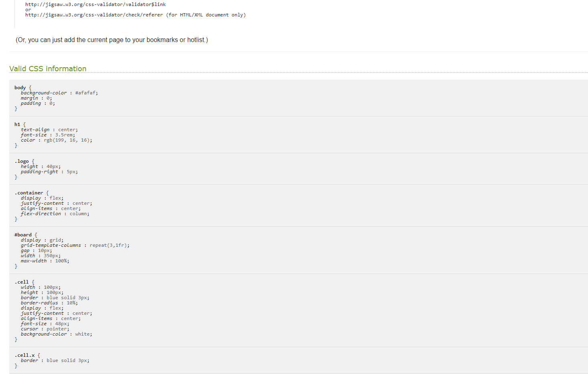
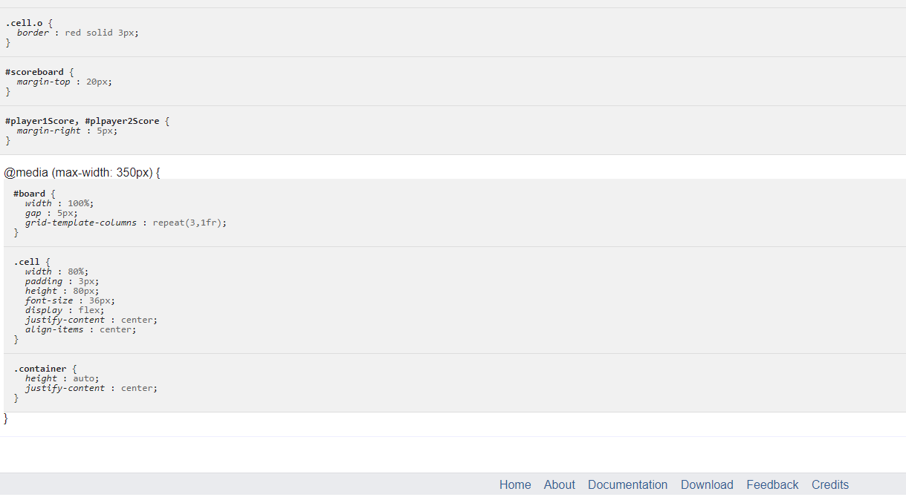

<h1 align="center">Noughts & Crosses</h1>

[View the live project here.](https://mitchduke.github.io/Noughts-and-Crosses-Milestone-2/)

This is a browser base game of noughts and crosses or tic tac toe to be played between two people for fun.

<h2 align="center"></h2>

## Table of Contents

1.  [User Experience](#user-experience-ux)
    -   [Design](#design)
    -   [Wireframes](#wireframes)

2.  [The Final Design](#the-final-design)
    -   [Main](#Main-page)

3.  [Features](#features)
    -   [Page Content](#page-content)

4.  [Technologies Used](#technologies-used)
    -   [Languages Used](#languages-used)
    -   [Frameworks, Libraries & Programs Used](#frameworks-libraries--programs-used)

5.  [Testing](#testing)
    -   [Validation](#validation)
    -   [Performance](#performance)
    -   [Further Testing](#further-testing)
    -   [Further Improvements](#further-improvements)
    -   [Testing User Stories from User Experience (UX) Section](#testing-user-stories-from-user-experience-ux-section)
        -   [First Time Visitor Goals](#first-time-visitor-goals-1)
        -   [Returning Visitor Goals](#returning-visitor-goals-1)
        -   [Frequent Visitor Goals](#frequent-user-goals-1)
    -   [Known Bugs](#known-bugs)

6.  [Deployment](#deployment)
    -   [Github Pages](#github-pages)
    -   [Forking The Github Repository](#forking-the-github-repository)
    -   [Making a Local Clone](#making-a-local-clone)

7.  [Credits](#credits)
    -   [Code](#code)
    -   [Content](#content)
    -   [Media](#media)
    -   [Acknowledgements](#acknowledgements)

## User Experience (UX)

-   ### User stories

    -   #### First Time Visitor Goals

        1. As a First Time Visitor, I want to easily understand the main purpose of the game.
        2. As a First Time Visitor, I want to be able to easily use the game.

    -   #### Returning Visitor Goals

        1. As a Returning Visitor, I want to find it easy to play again.

    -   #### Frequent User Goals
        1. As a Frequent User, I want to be able to play the game and it be obvious how to play.

-   ### Design
    -   #### Colour Scheme
        -   The main colours used are  rgb (0, 0, 255) Blue for the board tiles, rgb(255, 0, 0) Red for the title and when "O" is played in a tile the its border turns red and rgb (175, 175, 175) grey for the backgroung based on feedback about large areas of white on screen made for a poor user experience.
    -   #### Typography
        -   The Roboto font is the main font used throughout the whole website with Sans Serif as the fallback font in case for any reason the font isn't being imported into the site
            correctly. Roboto has a dual nature. It has a mechanical skeleton and the forms are largely geometric. At the same time, the font features friendly and open curves. While some grotesks distort their letterforms to force a rigid rhythm, Roboto doesn’t compromise, allowing letters to be settle in to their natural width. This makes for a more natural reading rhythm more commonly found in humanist and serif types.

*   ### Wireframes

    -   #### Main Page Wireframe - [View](https://github.com/MitchDuke/Noughts-and-Crosses-Milestone-2/blob/main/assets/images/Wireframe_1.PNG)

## The Final Design

-   ### Main Page
    -   

## Features

-   Responsive on all device sizes

-   Interactive elements

### Page Content

-   The main page is simplistic in its use and appearance, it is immediately obvious of its 
    purpose and how it is used.
-   The cells are clicked to activate the game using an event listener for the click.
-   Once the game is won it automatically tallies up the score for each player then 
    alternates to the other 
    player allowing the other player to go 1st.
-   The is a simple reset button to set the scores back to zero.

## Technologies Used

### Languages Used

-   [HTML5](https://en.wikipedia.org/wiki/HTML5)
-   [CSS3](https://en.wikipedia.org/wiki/Cascading_Style_Sheets)
-   [JAVASCRIPT](https://en.wikipedia.org/wiki/JavaScript)

### Frameworks, Libraries & Programs Used

1. [Font Awesome:](https://fontawesome.com/)
    - Font Awesome was used on all pages throughout the website to add icons for aesthetic and UX purposes..
1. [Git](https://git-scm.com/)
    - Git was used for version control by utilizing the Gitpod terminal to commit to Git and Push to GitHub.
1. [GitHub:](https://github.com/)
    - GitHub is used to store the projects code after being pushed from Git.
1. [Figma:](https://www.figma.com/)
    - Figma was used to create the [wireframes](https://github.com/) during the design process.
1. [Google Fonts:](https://fonts.google.com/)
    - Google Fonts was used to stlye the text elements of the game.

## Testing

The W3C Markup Validator and W3C CSS Validator Services were used to validate every page of the project to ensure there were syntax errors in the project which have been resolved.

### Validation

-   [W3C Markup Validator](https://jigsaw.w3.org/css-validator/#validate_by_input) - 
    [Results](https://github.com/)
-   [W3C CSS Validator](https://jigsaw.w3.org/css-validator/#validate_by_input) - [Results]
    (https://github.com/)
-   [ValidateJavaScript]https://validatejavascript.com/ - [Results](https://github.com/)

-   Using the above mentioned validators the following error logs have been recorded and actioned upon.
    -   index.html error log
        -   

    -   index.html error log resolved
        -   

    -   style.css error log
        -   
        -               
        -   

    -   JavaScript error log
        -   

### Performance

The sites performance was tested using Google Chrome Lighthouse to ensure it is responsive in desktop and mobile applications.

-   [Google Lighthouse Chrome Extension](https://chrome.google.com/webstore/detail/lighthouse/blipmdconlkpinefehnmjammfjpmpbjk?hl=en)

-   Using the above referrenced tools each page was tested in desktop and mobile versions 
    and the reocrds from the test are as follows.
    -   Main Page Desktop
    -   
    -   
    -   Main Page Mobile
    -   
   
    The overall performance is high due its simplistic nature.

### Further Testing

-   The Game was tested on Google Chrome, Microsoft Edge, Firefox browsers and their mobile 
    equivalents.
-   The website was viewed on a variety of devices such as Desktop, Laptop, Samsung S20A.
-   Friends and family members were asked to review the site and documentation to point out any bugs and/or user experience issues.
-   Friends who work in the programming industry were involved in debugging the code.

### Further Improvements

-   The game could be improved by adding more styling to the page to make it more visually interesting.
-   A high score count to keep track of multiple games using a database to store the scores.
-   Adding a simpe back ground may make it more visually appealing.
-   To be able to play a game against an opponent on different devices.

### Testing User Stories from User Experience (UX) Section

-   #### First Time Visitor Goals

    1. As a First Time Visitor, I want to easily understand the main purpose of the game 
    and learn how to play.

        1. When entering the game, users are presented with a clear game board containing a
        3x3 grid of empty cells. It's visually evident that this is a game of Noughts & Crosses (Tic-Tac-Toe) as the grid resembles the games layout.
        2. The games title "Noughts & Crosses" and the player symbols, X and O, provide a clear indication of the games purpose.
        3. The user has option to click on any cell in the grid to make their move.

    2. As a First Time Visitor, I want to be able to easily navigate and understand the  games interface.

        1. The games interface has been designed to be intuitive and usser-friendly. The game board is prominently displyed, and it's evident that users can click on the cells to make their move.
        2. There are no distracting elements, and the game's layout is straightforward, ensuring that users can focus on playing the game without confusion.

-   #### Returning Visitor Goals

    1. As a Returning Visitor, I want toenjoy a game of Noughts & Crosses without any hassle or having to remember how to play the game.

        1. The game board remains easily accessible, and players can quickly start a new game by clicking the "Reset Game" button.
        2. Theres no need to navigate through complex menus or instructions, allowing returning visitors to jump right into the game.

    2. As a Returning Visitor, I want to keep track of my wins.
        1. The game keeps a tally of wins for both Player 1 (X) and Player 2 (O). The scores are prominently displayed, allowing returning visitors to see their progress whilst they play the game.
        2. The "Player 1" and "Player2" labels beside the scores keep the game enganging and provide clarity on which player is which.

-   #### Frequent User Goals

    1. As a Frequent User, I want to challenge my friends to a game of Noughts & Crosses.

        1. Frequent users are already familiar with the game's interface and can easily invite friends to play by taking turns on the same device.
        2. The straighforward design ensures that the focus remains on the gameplay.

    2. As a Frequent User, I want to enjoy the game without distractions.

        1. The game of Noughts & Crosses provides a clean and immersive experience without any intrusive as or unrelated content.
        2. Frequent users can simply concentrate on having a fun game.

    3. As a Frequent User, I want to be able to keep track of my overall score whilst playing or reset the game to begin again.
        1. Frequent users can reset the game at any time by clicking the "Reset Game" button.
        2. The scores for both players are continuosly updated, allowing frequent users to compete and keep a record of their performance during a series of games.

### Known Bugs

-   On high resolution wide screens the Image next to the Title becomes small but stretching it into a larger size made it pixellated so its size has remained a constant. 

## Deployment

### GitHub Pages

The project was deployed to GitHub Pages using the following steps...

1. Log in to GitHub and locate the [GitHub Repository](https://github.com/MitchDuke/Noughts-and-Crosses-Milestone-2)
2. At the top of the Repository (not top of page), locate the "Settings" Button on the menu.
    - Alternatively Click [Here](https://raw.githubusercontent.com/) for a GIF demonstrating the process starting from Step 2.
3. Scroll down the Settings page until you locate the "GitHub Pages" Section.
4. Under "Source", click the dropdown called "None" and select "Master Branch".
5. The page will automatically refresh.
6. Scroll back down through the page to locate the now published site [link](https://github.com/MitchDuke/Noughts-and-Crosses-Milestone-2/) in the "GitHub Pages" section.

### Forking the GitHub Repository

By forking the GitHub Repository we make a copy of the original repository on our GitHub account to view and/or make changes without affecting the original repository by using the following steps...

1. Log in to GitHub and locate the [GitHub Repository](https://github.com/MitchDuke/Noughts-and-Crosses-Milestone-2)
2. At the top of the Repository (not top of page) just above the "Settings" Button on the menu, locate the "Fork" Button.
3. You should now have a copy of the original repository in your GitHub account.

### Making a Local Clone

1. Log in to GitHub and locate the [GitHub Repository] (https://github.com/MitchDuke/Noughts-and-Crosses-Milestone-2)
2. Under the repository name, click "Clone or download".
3. To clone the repository using HTTPS, under "Clone with HTTPS", copy the link.
4. Open Git Bash
5. Change the current working directory to the location where you want the cloned directory to be made.
6. Type `git clone`, and then paste the URL you copied in Step 3.

```
$ git clone https://github.com/MitchDuke/Noughts-and-Crosses-Milestone-2
```

7. Press Enter. Your local clone will be created.

```
$ git clone https://github.com/MitchDuke/Noughts-and-Crosses-Milestone-2
> Cloning into `CI-Clone`...
> remote: Counting objects: 10, done.
> remote: Compressing objects: 100% (8/8), done.
> remove: Total 10 (delta 1), reused 10 (delta 1)
> Unpacking objects: 100% (10/10), done.
```

Click [Here](https://help.github.com/en/github/creating-cloning-and-archiving-repositories/cloning-a-repository#cloning-a-repository-to-github-desktop) to retrieve pictures for some of the buttons and more detailed explanations of the above process.

## Credits

### Code

-   [Font awesome](https://fontawesome.com/): Font Awesome was used through out the project to add styling to headings.

### Content

-   All content was written by the developer.

### Media

-   The image in the H1 title is the property of Ungureanu Alexandra, Shutterstock and I found it here https://www.collinsdictionary.com/dictionary/english/noughts-and-crosses.

### Acknowledgements

-   My Mentor for continuous helpful feedback.
-   My tutor for his support and guidance throughout the project.
-   My step children and wife for playing the game trying to break it with high scores and using their phones to test it on smaller devices.
-   My friend Simon Nightingale who helped me test the project on various platforms and browsers.
-   Tutor support at Code Institute for their support.